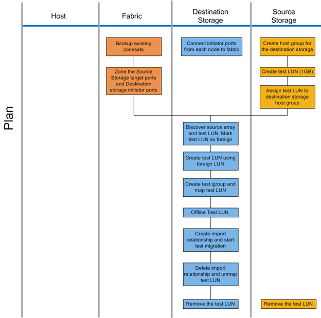

= 计划阶段工作流
:allow-uri-read: 
:icons: font
:imagesdir: ../media/

[role="lead"]
数据迁移过程的规划阶段侧重于创建详细的迁移计划并确保所有内容均已准备好进行实际迁移所需的任务。大多数迁移工作都是在此阶段执行的规划。

在规划阶段，您可以使用在分析阶段收集的主机差距分析信息制定修复计划。在规划时使用主机修复信息。验证端到端连接后，将执行测试迁移，以确保在开始生产迁移之前正确配置所有内容。

下图显示了计划工作流。

下表列出了规划阶段的任务。

[cols="2*"]
|===
| 组件 | 任务 

 a| 
网络结构
 a| 
. 备份现有区域集。
. 将源存储分区到目标存储。

 a| 
目标存储
 a| 
. 将启动程序端口连接到网络结构。
. 发现源存储并测试 LUN 。将源 LUN 标记为外部。
. 使用外部 LUN 创建测试 LUN 。
. 创建测试 igroup 并映射测试 LUN 。
. 使测试 LUN 脱机。
. 创建导入关系并开始测试迁移。
. 删除导入关系并取消映射测试 LUN 。
. 删除测试 LUN 。

 a| 
源存储
 a| 
. 使用启动程序端口 WWPN 为目标存储创建主机组。
. 创建测试 LUN （ 1 GB ）。
. 将（映射 / 屏蔽）测试 LUN 分配给目标存储主机组。
. 删除测试 LUN 。

|===