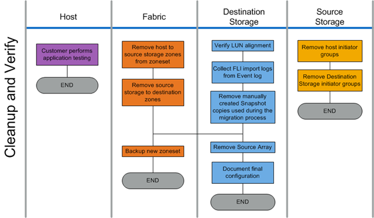

= 验证阶段工作流
:allow-uri-read: 
:icons: font
:imagesdir: ../media/

[role="lead"]
迁移过程的验证阶段侧重于迁移后清理以及确认迁移计划执行的准确性。源存储上的启动程序记录以及源和目标区域之间的分区将被删除。

下图显示了验证阶段的工作流。

下表列出了验证阶段任务。

[cols="2*"]
|===
| 组件 | 任务 

 a| 
主机
 a| 
客户执行应用程序测试。

 a| 
网络结构
 a| 
. 从区域集中删除主机到源存储分区。
. 将源存储删除到目标分区。
. 备份新的区域集。

 a| 
目标存储
 a| 
. 验证 LUN 对齐。
. 从事件日志收集 FLI 导入日志。
. 删除在迁移过程中使用的手动创建的 Snapshot 副本。
. 删除源阵列。
. 记录最终配置。

 a| 
源存储
 a| 
. 删除主机存储启动程序组。
. 删除目标存储启动程序组。

|===