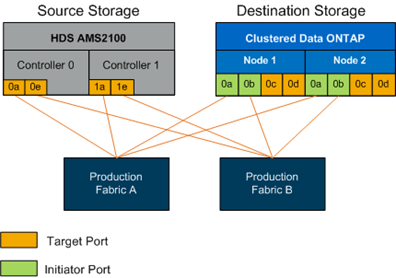

= 配置交换机分区
:allow-uri-read: 
:icons: font
:imagesdir: ../media/

[role="lead"]
您必须在 SAN 交换机上创建所需的分区，以便将源存储连接到目标存储。

.步骤
. 备份生产和迁移网络结构中每个交换机上的现有区域集。
. 对源存储和目标存储进行分区，如下所示。
+

. 创建分区并将其添加到生产网络结构 A 中的区域集
+
以下是区域 zone_AMS2100_cDOT_Initiator_faba 的生产区域生产网络结构 A 的示例。

+
|===
| WWPN | 区域成员 

 a| 
 50:06:0e:80:10:46:b9:60 a| 
 AMS2100 Ctrl 0 Port 0a

 a| 
 50:06:0e:80:10:46:b9:68 a| 
 AMS2100 Ctrl 1 Port 1a

 a| 
 50:0a:09:80:00:d3:51:59 a| 
 ONTAP Node 1 Port 0a

 a| 
 50:0a:09:80:00:e7:81:04 a| 
 ONTAP Node 2 Port 0a
|===
. 激活网络结构 A 中的区域集
. 创建分区并将其添加到生产网络结构 B 中的区域集
+
以下是区域 zone_AMS2100_cDOT_Initiator_fabB 的生产区域生产网络结构 A 的示例。

+
|===
| WWPN | 区域成员 

 a| 
 50:06:0e:80:10:46:b9:64 a| 
 AMS2100 Ctrl 0 Port 0e

 a| 
 50:06:0e:80:10:46:b9:6c a| 
 AMS2100 Ctrl 1 Port 1e

 a| 
 50:0a:09:80:00:d3:51:59 a| 
 ONTAP Node 1 Port 0b

 a| 
 50:0a:09:80:00:e7:81:04 a| 
 ONTAP Node 2 Port 0b
|===
. 激活生产网络结构 B 中的区域集

