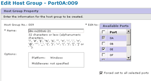

= 从主机中删除源 LUN
:icons: font
:imagesdir: ../media/

[role="lead"]
以下步骤介绍了如何在 FLI 迁移完成后从主机中删除源 LUN 。

NOTE: 此任务会在示例中使用 _HDS AMS2100_ 阵列。如果您使用的是不同的阵列或不同版本的阵列图形用户界面，则您的任务可能会有所不同。

要从主机中删除源 LUN ，请完成以下步骤：

.步骤
. 登录到 Hitachi Storage Navigator 模块化。
. 选择要迁移的主机，然后选择 * 编辑主机组 * 。
+
image::../media/remove_source_luns_from_host_1.png[从主机 1 中删除源 LUN]

. 选择 * 端口 * ，然后选择 * 强制设置 * 到所有选定端口。
+

. 选择从分配的逻辑 LUN 迁移的主机 LUN 。对源 LUN 工作表中提及的每个主机使用 LUN 名称。在此处，选择 Windows 2012 主机的 LUN ，然后选择 * 删除 * 。
+
image::../media/remove_source_luns_from_host_3.png[从主机 3 中删除源 LUN]

. 对 Linux 和 VMware ESX 主机重复上述步骤。

