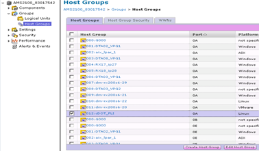

= 从 ONTAP 存储中删除源 LUN
:allow-uri-read: 
:icons: font
:imagesdir: ../media/

[role="lead"]
以下步骤介绍了如何在迁移完成后从 ONTAP 存储中删除源 LUN 。

NOTE: 此任务会在示例中使用 _HDS AMS2100_ 阵列。如果您使用的是不同的阵列或不同版本的阵列图形用户界面，则您的任务可能会有所不同。

.步骤
. 登录到 Hitachi Storage Navigator 模块化。
. 选择在计划阶段创建的 ONTAP 主机组，然后选择 * 编辑主机组 * 。
+

. 选择 * 端口 * ，然后选择 * 强制设置 * 到所有选定端口。
+
image::../media/remove_source_luns_from_ontap_storage_2.png[编辑主机组]

. 选择从分配的逻辑 LUN 迁移的主机 LUN 。对源 LUN 工作表中提及的每个主机使用 LUN 名称。在此处，选择 Windows 2012 ， RHEL 5.10 和 ESXi 5.5 主机的 LUN ，然后选择 * 删除 * 。
+
image::../media/remove_source_luns_from_ontap_storage_3.png[从 ONTAP 存储中删除源 LUN 3.]

